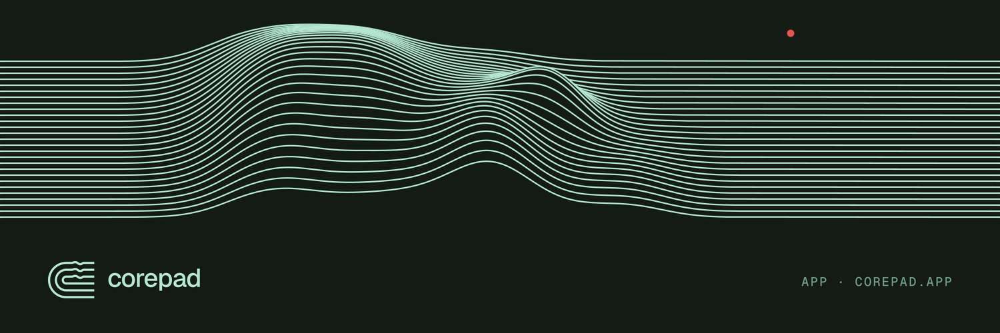
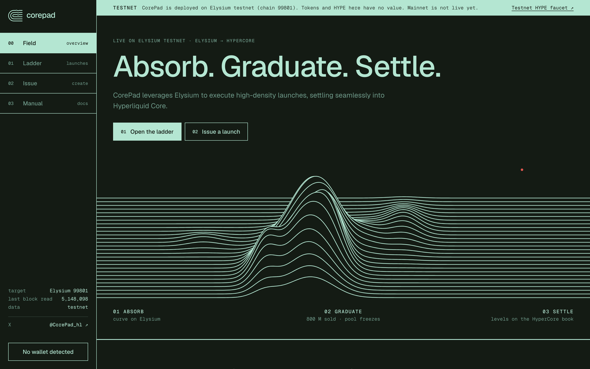
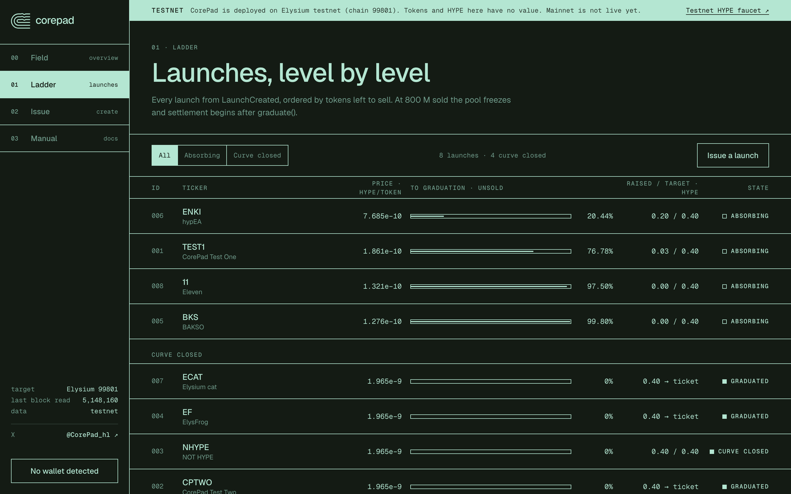
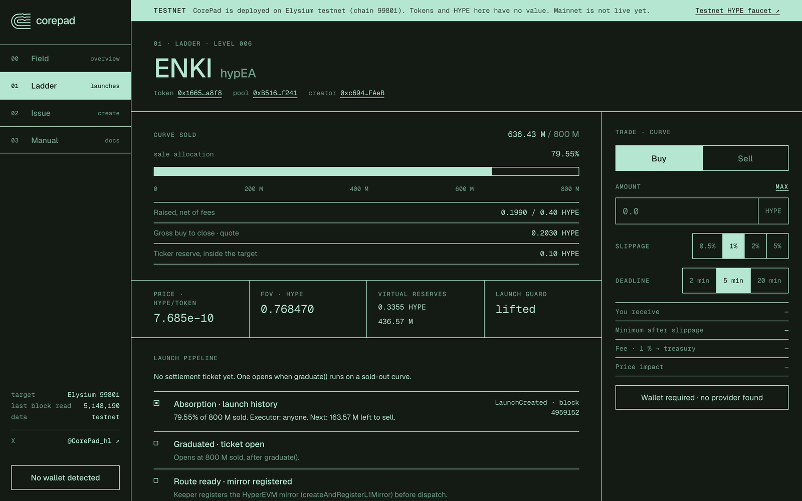
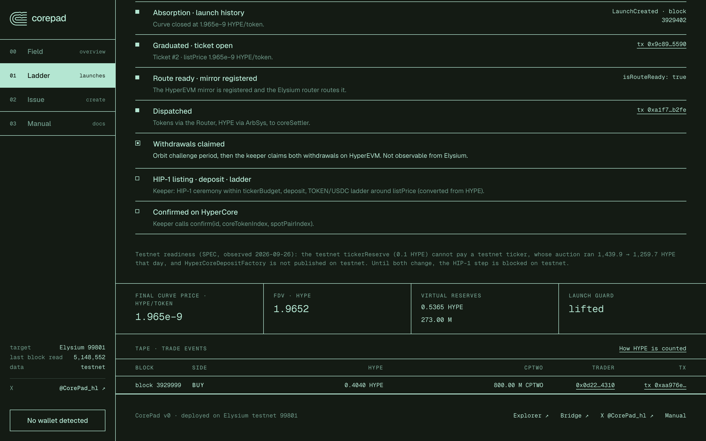
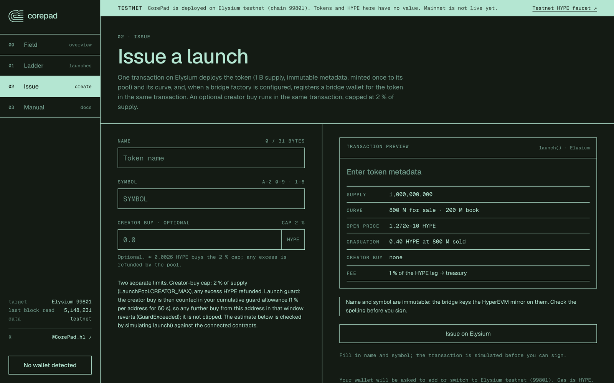
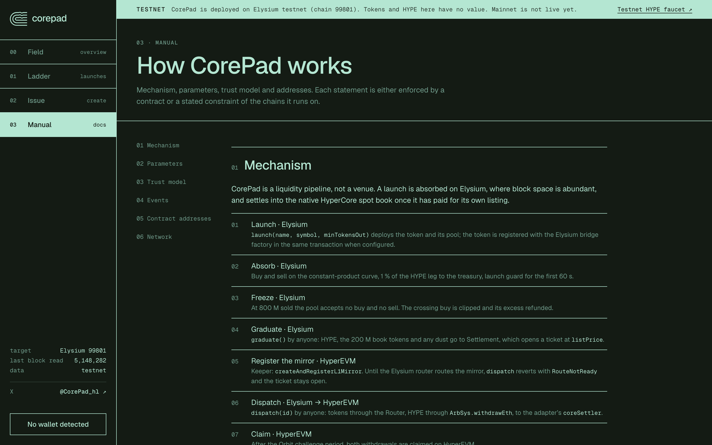
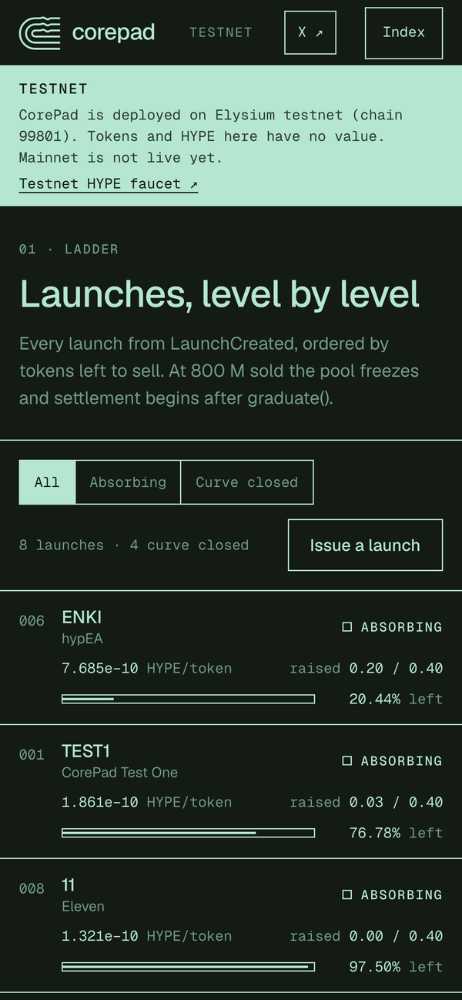
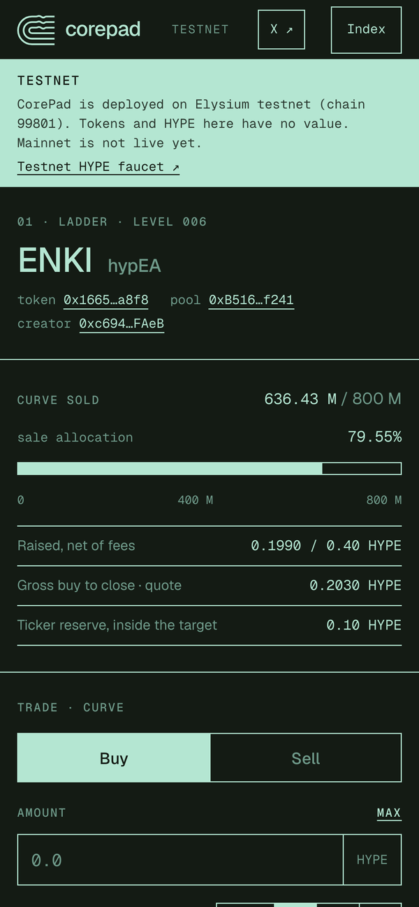

<p align="center">
  
</p>

<p align="center">
  <a href="https://corepad.app"></a>
  
  
  <a href="https://github.com/CorePad-team/corepad-contracts"></a>
  <a href="https://x.com/CorePad_hl"></a>
</p>

# CorePad app

> CorePad leverages Elysium to execute high-density launches, settling seamlessly into Hyperliquid Core.

The front end of CorePad, live at **[corepad.app](https://corepad.app)**. Every number on screen is read from
the chain: launches from `LaunchCreated`, prices and reserves from each `LaunchPool`, and the settlement
pipeline from `Settlement` tickets and the bridge route. No indexer, no backend database.

<p align="center">
  
</p>

## Ladder

Every launch, ordered by tokens left to sell. At 800 M sold the pool freezes and anyone can call `graduate()`.

<p align="center">
  
</p>

## Launch page

Curve progress, price, FDV, virtual reserves, the launch guard, and a buy/sell panel with slippage and deadline.

<p align="center">
  
</p>

## Settlement pipeline

Each step from graduation to the HyperCore book, with the transaction that completed it. Launch #2 (CPTWO)
went through graduation, mirror registration and dispatch on testnet.

<p align="center">
  
</p>

## Issue and manual

<table>
  <tr>
    <td width="50%"></td>
    <td width="50%"></td>
  </tr>
  <tr>
    <td align="center"><sub>Issue a launch: name, symbol (unique, reserved tickers refused), optional creator buy</sub></td>
    <td align="center"><sub>Manual: mechanism, parameters, trust model, events, every contract address</sub></td>
  </tr>
</table>

## Mobile

<p align="center">
  
  &nbsp;
  
</p>

## Run it

```bash
npm install
npm run dev        # local dev server
npm run build      # brand check + production build to dist/
npm run typecheck
```

The deployment manifest is `src/deployments/99801.json` (copied from `corepad-contracts/deployments/`). A dry-run
manifest is never treated as a deployment: the app then shows a pre-deployment state. `api/rpc.js` is a small
RPC proxy used by the deployed site, with the public Elysium RPC as fallback.

## Layout

```
src/views/   home (Field), ladder, launch, issue, manual
src/abi/     contract ABIs exported from corepad-contracts
src/chain.ts reads: launches, pools, tickets, route readiness
src/config.ts network, deployment manifest, bridge contract references
api/rpc.js   RPC proxy
```
